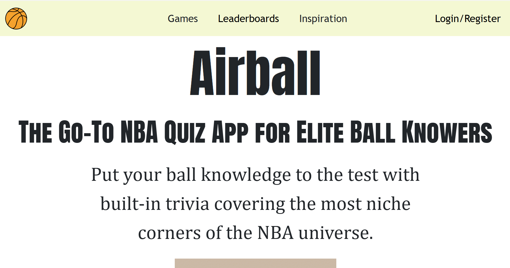
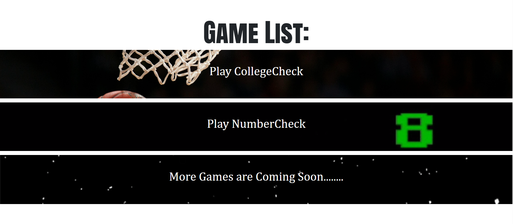
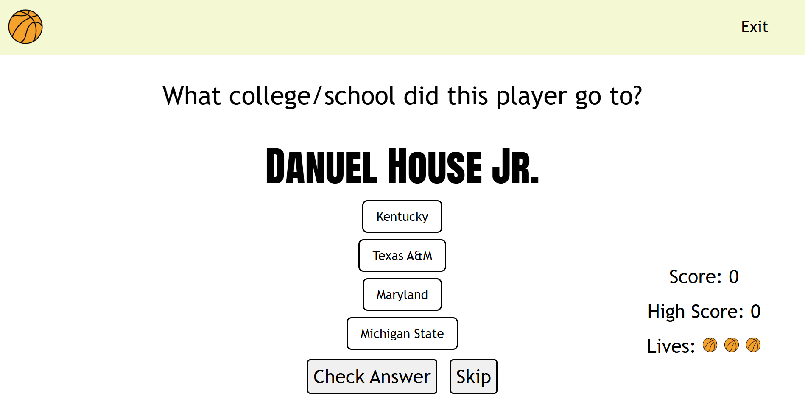
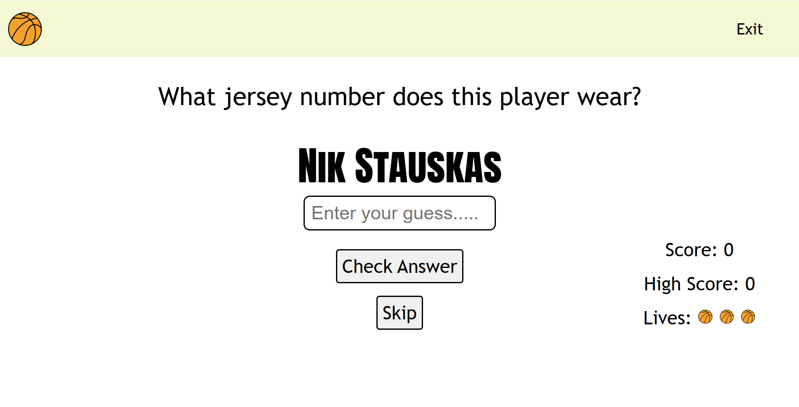
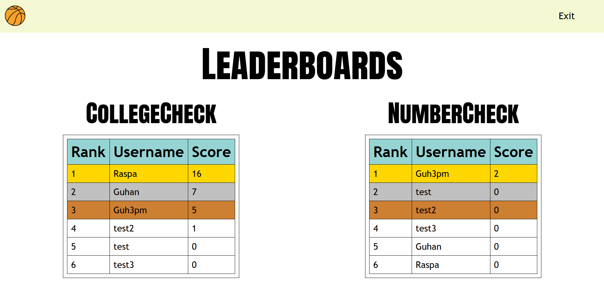

# Airball 🏀  
A full-stack NBA trivia platform where elite ball knowers can test their knowledge.  

## Features  
- 🔑 User authentication with sessions  
- 📊 Persistent leaderboard  
- 🎓 CollegeCheck quiz mode (guess the player’s college)  
- 🎽 JerseyCheck quiz mode (guess the player’s jersey number)  
- 🌐 Fully deployed with custom domain + SSL on Railway  

## Tech Stack  
- **Frontend:** EJS, CSS, JavaScript  
- **Backend:** Node.js, Express, Axios, Passport
- **Database:** PostgreSQL  
- **Deployment:** Railway + Custom Domain  

## Demo  
👉 [Live Site](https://www.airballtrivia.com/)  

## Screenshots

 
 
 
   
